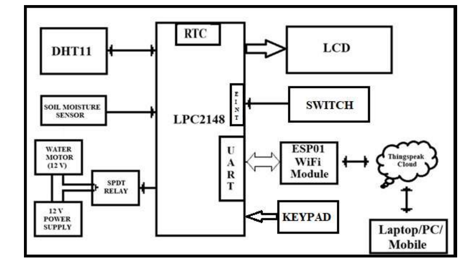
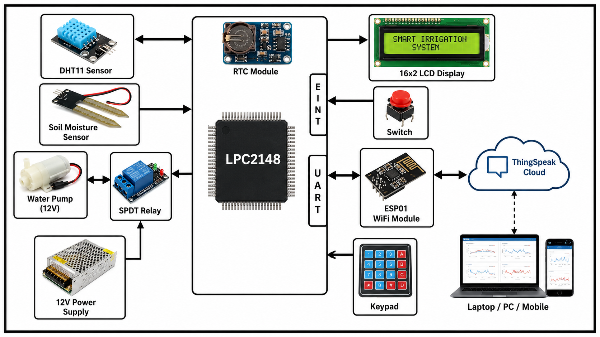
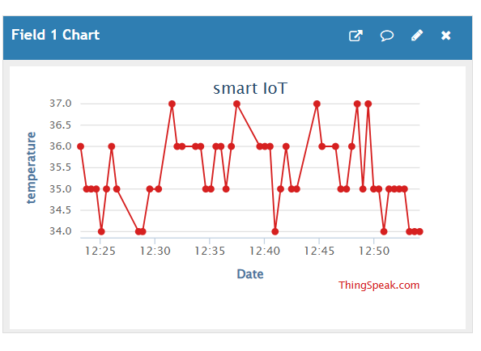
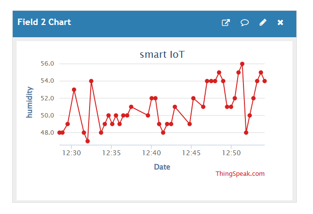
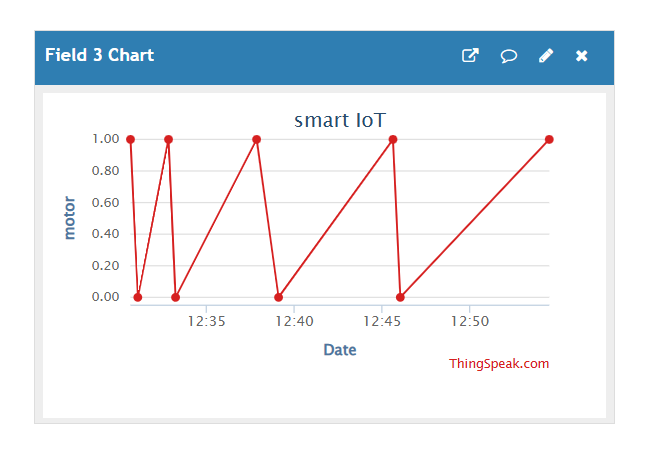

# Smart IoT Irrigation System using LPC2148 and ESP01

A **Smart IoT Irrigation System** developed using **LPC2148 ARM7**, **Embedded C**, and **ESP01 Wi-Fi module** for automated agricultural monitoring and irrigation control.

## Features

* Soil Moisture Monitoring
* Temperature & Humidity Monitoring (DHT11)
* Automatic Motor Control
* ESP01 IoT Connectivity
* ThingSpeak Cloud Monitoring
* 16x2 LCD Display

## Hardware Used

* LPC2148 ARM7 Microcontroller
* Soil Moisture Sensor
* DHT11 Sensor
* ESP01 Wi-Fi Module
* 16x2 LCD
* Relay Module & Water Pump

## Block Diagram

 
 

## Working Principle

The system continuously monitors **soil moisture, temperature, and humidity**. When soil moisture drops below a threshold value, the controller automatically turns **ON** the irrigation motor. After sufficient moisture is detected, the motor turns **OFF**.

Sensor readings are transmitted through the **ESP01 Wi-Fi module** to **ThingSpeak Cloud** for remote monitoring.

## Hardware connections
### Hardware 

## ThingSpeak Cloud Monitoring

### Temperature Graph

### Humidity Graph

### Motor status graph

### LCD Display 

## Technologies Used

* Embedded C
* ARM7 LPC2148
* UART Communication
* IoT / Cloud Monitoring
* ThingSpeak API

## Applications

* Smart Agriculture
* Automated Irrigation
* Water Management
* Environmental Monitoring
